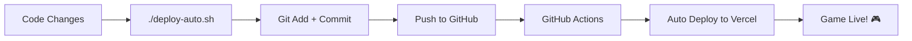

# 🚀 SETUP AUTO DEPLOYMENT - SUPER MUDAH!

## 🎯 **APA INI?**
Setup sekali, deploy selamanya! Setiap kali kamu push ke GitHub, game otomatis deploy ke Vercel.

---

## ⚡ **QUICK START (5 MENIT)**

### 1. **Setup GitHub Secrets**
Buka GitHub repository → Settings → Secrets and variables → Actions

Tambah 3 secrets ini:
```
VERCEL_TOKEN=your_vercel_token_here
VERCEL_ORG_ID=your_org_id_here  
VERCEL_PROJECT_ID=your_project_id_here
```

### 2. **Cara Dapat Token & IDs:**

**VERCEL_TOKEN:**
1. Login ke https://vercel.com/account/tokens
2. Create new token → Copy

**VERCEL_ORG_ID & PROJECT_ID:**
```bash
# Install Vercel CLI
npm install -g vercel

# Login
vercel login

# Link project (dalam folder game)
vercel link

# Lihat file .vercel/project.json
cat .vercel/project.json
```

### 3. **Test Auto Deploy**
```bash
# Deploy dengan 1 command!
./deploy-auto.sh "Test auto deployment"
```

---

## 🤖 **AUTO DEPLOYMENT FLOW**



**Yang Terjadi:**
1. 📝 Kamu edit code
2. 🚀 Run `./deploy-auto.sh`
3. 📦 Script auto commit + push
4. 🤖 GitHub Actions triggered
5. ⚡ Vercel auto deploy
6. 🎮 Game live dalam 2-3 menit!

---

## 📋 **DEPLOYMENT COMMANDS**

### **Super Simple (Recommended):**
```bash
./deploy-auto.sh "Game update v1.1"
```

### **Manual Git + Auto Deploy:**
```bash
git add .
git commit -m "Update game"
git push origin main
# GitHub Actions akan auto-deploy
```

### **Direct Vercel (No GitHub):**
```bash
./deploy.sh
```

---

## 🔧 **TROUBLESHOOTING**

### **❌ GitHub Actions Failed?**
1. Check secrets di GitHub repository settings
2. Pastikan VERCEL_TOKEN valid
3. Check logs di GitHub Actions tab

### **❌ Git Push Failed?**
```bash
# Check remote
git remote -v

# Set remote jika belum ada
git remote add origin https://github.com/yourusername/energy-quest-game.git

# Push with force jika perlu
git push -f origin main
```

### **❌ Vercel CLI Error?**
```bash
# Reinstall Vercel CLI
npm uninstall -g vercel
npm install -g vercel@latest

# Re-login
vercel login
vercel link
```

---

## 🎯 **DEPLOYMENT URLS**

Setelah setup, game akan otomatis deploy ke:
- **Production**: https://energi-listrik.vercel.app
- **Preview**: https://energy-quest-[branch].vercel.app

---

## 🏆 **DEPLOYMENT FEATURES**

✅ **Auto Deploy**: Push = Auto deploy  
✅ **Branch Previews**: Test features sebelum merge  
✅ **Rollback**: Easy rollback jika ada masalah  
✅ **Analytics**: Vercel analytics built-in  
✅ **CDN**: Global fast loading  
✅ **HTTPS**: SSL certificate otomatis  
✅ **Custom Domain**: Easy domain setup  

---

## 🎮 **READY TO USE!**

Sekarang tinggal:
1. Setup secrets di GitHub (5 menit)
2. Run `./deploy-auto.sh`
3. Game otomatis live di Vercel!

**Energy Quest siap dimainkan oleh ribuan siswa! ⚡🎯🏆**